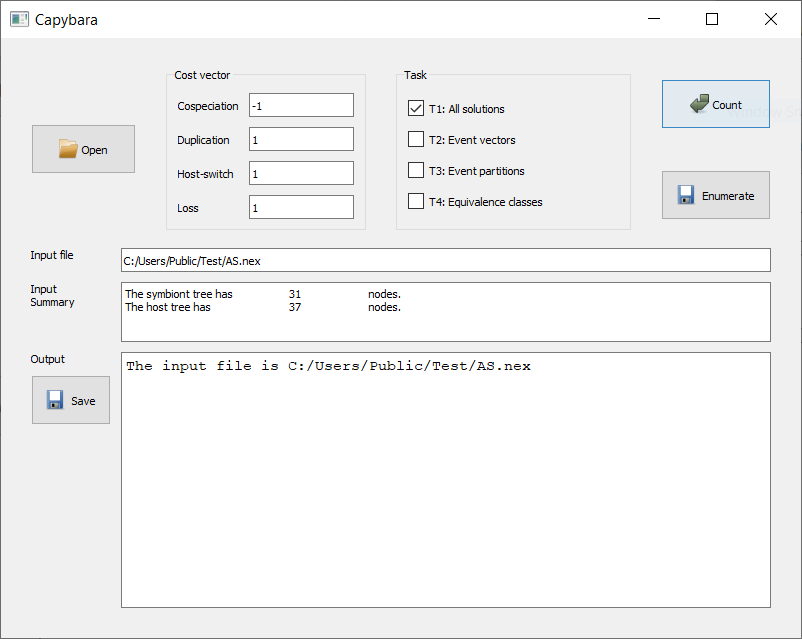

.. |EUCALPYT| image:: resources/eucalypt.png
   :height: 1em
   :target: http://eucalypt.gforge.inria.fr/

.. _Optimal enumeration:

*******************
Optimal enumeration
*******************

.. contents:: Table of Contents

.. _Enumeration tasks:

Definitions of tasks
====================

By choosing the option *Standard counting and enumeration* in Capybara, the user can either count or list one of the following:

For a given input file and a given cost vector, let **S** be the set containing all reconciliations of minimum cost (cyclic or acyclic).

Task T1: All solutions
----------------------

:guilabel:`Count`: size of **S**.

:guilabel:`Enumerate`: the set **S**.

Task T2: Event vectors
----------------------

:guilabel:`Count`: number of different event vectors in **S**.                     

:guilabel:`Enumerate`: all different event vectors in **S**.
                                                            
The **event vector** of a reconciliation is a vector of four integers representing the number of occurrences of cospeciation, duplication, host-switch, and loss events.                      

Two reconciliations have the same event vectors if the numbers of each event are the same.                        

Task T3: Event partitions
-------------------------

:guilabel:`Count`: number of different event partitions in **S**.

:guilabel:`Enumerate`: all different event partitions in **S**.

The **event partition** of a reconciliation is a partition of the internal nodes of the symbiont tree
into three subsets: cospeciation, duplicaiton, and host-switch nodes.           

Two reconciliations have the same event partitions if, for each node in the symbiont tree,
the assigned events (cospeciation, duplication, host-switch) are the same, regardless of the hosts.

Task T4: Cospeciation-Duplication Equivalence classes
-----------------------------------------------------

:guilabel:`Count`: number of equivalence classes in **S**.

:guilabel:`Enumerate`: all equivalence classes in **S**.

Two reconciliations are considered **CD-equivalent** if, for each node in the symbiont tree,
the assigned events (cospeciation, duplication, host-switch) are the same, moreover, the assigned hosts
are also the same except when the event is a host-switch.

.. _Enumeration input:

Loading an input file
=====================

The input format is the same as for |eucalpyt|. 
:download:`Here is an example input file <resources/AS.nex>`.
Note that the symbiont tree can be also introduced in a block starting with `BEGIN SYMBIONT` instead of `BEGIN PARASITE`.

After loading a file with the :guilabel:`Open` button, the input file information is displayed, and
the other buttons become available:

.. admonition:: Cost vector

   * Before clicking on the :guilabel:`Count` or :guilabel:`Enumerate` button, choose the desired cost vector.
   * All four numbers must be **integers**.
   * Floating point numbers will be rounded towards zero (3.6 becomes 3, -3.6 becomes -3).
   * Different cost vectors can be used, for example, across differents runs of the counting tasks, without needing to re-load the input file.

.. Tip:: 
   - The file openning and saving dialogs have their own application-wide favorites list. 
     The user can add a folder to the favorites list using drag and drop to have quicker access in the future.
   - Not sure what an option means? Most buttons and boxes have help messages (tooltip). These will appear when the mouse cursor moves over an item. 

Counting
========

Basic usage
-----------

The user can check multiple boxes in **Task** then click on the :guilabel:`Count` button for the results to be printed directly in the **Output** area. 

It is possible to save the on-screen text output to a file using the :guilabel:`Save` button.
    

Example
-------

Here is the output of all four counting tasks on the :download:`example input <resources/AS.nex>`: ::

    ===============
    Job started at 2019-09-20 15:24:52
    Cost vector: (-1, 1, 1, 1)
    ------
    Task 1: Counting the number of solutions (cyclic or acyclic)...
    Total number of solutions = 18
    ------
    Task 2: Counting the number of solutions grouped by event vectors...
    1: [8, 1, 6, 2] of size 4
    2: [9, 1, 5, 4] of size 2
    3: [9, 0, 6, 4] of size 4
    4: [8, 0, 7, 2] of size 8
    Total number of event vectors = 4
    Total number of solutions = 18
    ------
    Task 3: Counting the number of event partitions...
    Total number of event partitions = 4
    ------
    Task 4: Counting the number of CD equivalence classes...
    Total number of strong equivalence classes = 4
    ------
    Optimal cost = 1.0
    ------
    Job finished at 2019-09-20 15:24:52
    Time elapsed: 0.71 s
    ===============

Listing
=======

Basic usage
-----------

Use the :guilabel:`Enumerate` button for listing solutions to a file that can be used for analysis or visualization.
Unlike the :guilabel:`Count` button, it allows only one task box to be checked at a time.

After choosing the output file name, the user selects additional options, depending on the task. Once the additional options are confirmed, the computation starts automatically, and a progress bar pops out. It is possible to stop the computation at anytime by closing the progress bar (the program may freeze for a few seconds).

Note that the on-screen text output (human-readable trace of computational tasks) can still be saved using the :guilabel:`Save` button.

    
Options for tasks T1 and T2
---------------------------

The output is in the same format as the output of |eucalpyt|. And just like in |eucalpyt|, the user can choose the maximum number of solutions that she likes to generate.

For the task T1 (all optimal reconciliations) only, it is possible to keep only the acyclic reconciliations.

Here is an example of the on-screen output when this option is chosen, for :download:`another input file <resources/SFC.nex>` and cost vector (0,1,1,1): ::

    ===============
    Job started at 2019-09-20 19:40:04
    Cost vector: (0, 1, 1, 1)
    Task 1: Enumerate acyclic solutions...
    ------
    Number of acyclic solutions = 144 out of 184
    Optimal cost = 11.0
    Output written to C:/Users/Public/Test/output.txt
    ------
    Job finished at 2019-09-20 19:40:05
    Time elapsed: 0.63 s
    ===============

.. _Output options:

Options for tasks T3 and T4
---------------------------

There are two output types:

.. figure:: resources/Capture2.png

   
**Labels only**

   If the first output type `"labels only"` is chosen, the result will be compatible with the `new visualization tool Capybara Viewer`_.

   **Task T3**: Each event partition is represented by the assignment, to each internal symbiont node, of one of the three events.

   **Task T4**: Each CD-equivalence class is represented by the assignment, to each internal symbiont node, of one of the three events, and the assignment of a host hame to each symbiont node with non-host-switch event.

**Reconciliation**

   If the second output type `"reconciliation"` is chosen, the result will be compatible with the `the original viewer <http://eucalypt.gforge.inria.fr/viewer.html>`__ for |eucalpyt|. 

   Note that in this case, the output is only one reconciliation chosen arbitrarily among the potentially many (cyclic or acyclic) reconciliations having the same event partition or belonging in the same CD-equivalence class.

.. _new visualization tool Capybara Viewer: visualization.html

