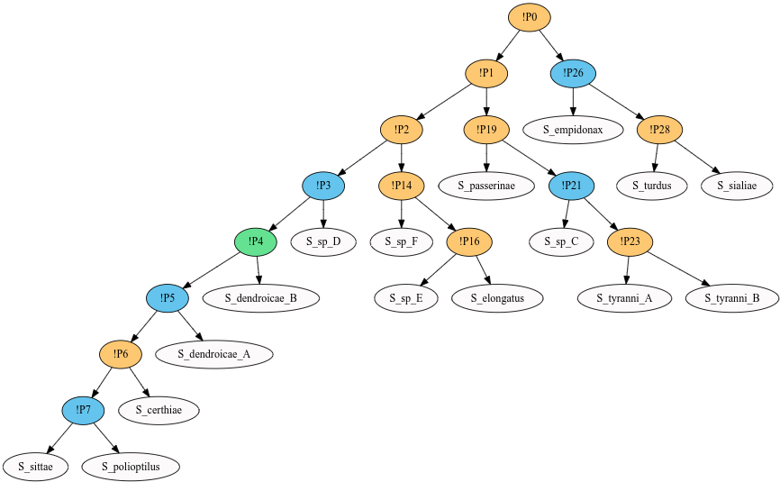
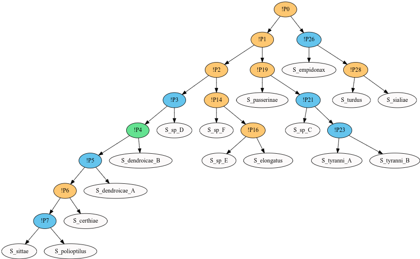

.. |EUCALPYT| image:: resources/eucalypt.png
   :height: 1em
   :target: http://eucalypt.gforge.inria.fr/

.. _Output visualization:

********************
Output visualization
********************

For visualizating reconciliations (symbiont tree drawn on top of the host tree), 
use `the original viewer <http://eucalypt.gforge.inria.fr/viewer.html>`__ for |eucalpyt|.

For visualizating event partitions or equivalence classes (colorings of the parasite tree with animation), 
use the `new animated web tool Quokka Viewer <https://observablehq.com/@heliow/tree-viewer>`__.

Next we present the usage of the new visualization tool.

Input format
------------

The Quokka visualizer tool takes two input formats generated from the third tab *Convert enumeration files for visualization* of the main Quokka tool:

- File input (DOT format) can be saved into the filesystem by clicking the :guilabel:`Save` button. This file needs to be uploaded into Quokka viewer
  after selecting the first upload method.

- Plain text input can be copied into the user's clipboard by clicing the :guilabel:`Copy` button. Then the clipboard content can be pasted into Quokka viewer.

  Note that the text area for copy-and-paste is hidden by default, and will only appear after the user selects the second upload method *Copy and paste text*.

.. note::
    When the Quokka app closes, the clipboard content will also be cleared. Therefore, if you choose the second upload method, *do not* close the main app while using the viewer.

Graphical elements
------------------

One event partition or equivalence class will be drawn as a colored symbiont tree. 

Texts
  The names of the nodes in the symbiont tree are shown.

Colors
  The internal nodes of the symbiont tree are colored according to the event. The correspondance between color and event is shown in the legend on top of the graphic area.

Hover texts
  When the mouse hovers over a node, the corresponding host name, if known, is shown in small tag. This applies to all leaf nodes of the symbiont tree, or, in an equivalence class, those internal nodes with non-host-switch event.

Visualization methods
---------------------

One **frame** of the animation corresponds to one event partition, or one equivalence class.

The user can:

- Either **play the animation**, i.e., a continous transition of images from one frame to another. The transition time can be adjusted. 
  This method is interesting because it can provide a quick global view on multiple solutions. Combined with a screen-recording tool, it can also produce a video output.

- Or **freeze the animation** at one particular frame. This can be useful for checking the host names in equivalence classes.

A single frame can be **saved in a image file**, either by using the save button on top of the legend, or by using the cell menu (this menu appears when clicking the three small dots on the top left corner of the graphic area).

Example
-------

There are 4 event partitions on :download:`this example input file <resources/AS.nex>` and cost vector (-1,1,1,1). Thereofre, there are 4 frames in the animation.

**Frame 1:**

**Frame 2:**

**Frame 3:**

**Frame 4:**

